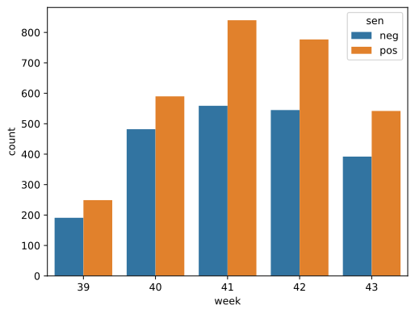

# Reddit-LegalAdvice-CommunityDetection

For many, obtaining legal advice is often not an accessible option due to the high cost of hiring
a lawyer. r/legaladvice aims to mitigate this by acting as an open space for people to talk about
their legal issues and receive simple solutions or help on how to next approach their problem.
The subreddit contains posts relating to a wide range of issues from battles with landlords to
individuals being sued for millions of dollars, and unlike a true lawyer, the comments do not
have to remain unbiased. Replies host a variation of responses with some being overly
sympathetic to a person’s position and others wondering how someone could possibly get
themselves into such a situation. Because of this drastic difference in comments, this paper
analyzes the sentiment of comments in r/legaladvice and whether these sentiments are
segmented by communities within the subreddit’s network.

## Methods
The overall aim is to quantify whether sentiment significantly varies by network communities
within r/legaladvice. The Reddit Praw library was utilized to obtain the past month (09-29-2023
through 10-29-2023) of top posts and all of their existing comments. The decision to use this
time period and subset of posts was made under the assumption that the top posts would have
more variation in sentiment since they are more likely to be extreme posts. Using only the past
month helps ensure that posts have had a more equal amount of time to receive comments
compared to an entire year of posts. For each post, all comments, including replies, were
scraped with post_id, time and date of posting, post title, comment author, comment body, and
parent author, where parent author is either the author of the post or the previous comment
depending on if the comment was a top-level comment or a reply. The final dataset contains
5,164 comments in total.

The sentiment of each comment was then analyzed using the NLTK Sentiment Analyzer library.
Almost every comment was majority neutral sentiment, so the maximum percentage between
the positive and negative sentiment was computed and each comment was labeled as such. A
directed network was then created of the posts where each post represents a user in the
dataset who has either written a post or a comment and the edges connect from the person
who wrote the comment to who they are replying to. Each edge received an attribute of the
comment’s majority sentiment, and a subgraph of only the largest connected component was
created so that outlying posts would not have an impact on the communities.

The remainder of the methods loosely follows those outlined in Sluban’s work. The Girvan-
Newman algorithm was used to create two communities where each community contains a list
of users. Within each community, each user’s ratio of the number of positive comments to the
number of negative comments and each user’s average sentiment value were calculated. Two
sample t-tests were conducted for both of these metrics to identify if there was a significant
difference between the values for each community.

## Results
Figure 1 depicts the number of comments throughout the course of the month. It is relatively
periodic with weekends having a higher number of comments. From the set of 99 posts and
5,164 comments, there are 1,092 unique parent authors – those who were replied to (either a
poster or fellow commenter). Of those who replied, there are 2,998 unique comment authors.

The average positive sentiment value is 0.09 and the average negative sentiment value is
-0.075, meaning that top posts are overall more strongly positive than negative. Figure 2
displays the largest node of the network with positive sentiment comments displayed as green
edges and negative sentiment comments displayed as red edges. There are no trends in the
sentiment that are especially apparent when looking at the figure. Both positive and negative
sentiments are relatively dispersed throughout the network. Figure 3 displays the number of
positive and number of negative comments by week within the past month. The number of
positive comments outweighs the number of negative comments each week.

When grouped into communities, community one contains 2,922 users and 5,056 posts, and
community two contains 85 users and 111 posts. The ratio of average number of positive to
negative comments for community one is 1.42 and for community two is 1.27. The average
sentiment value for community one is 0.009 and for community two is -0.01. Table 1 depicts the
t-test results for the ratio of average number of positive to negative comments. The p-value is practically 0.0 with a difference in means of 0.158.

Table 2 depicts the t-test results for the average sentiment value. The p-value is 0.234 with a difference in means of 0.019.

## Analysis
The p-value of practically 0.0 for the ratio of average number of positive to negative comments
indicates that there is a significant difference between these values for community one and
community two. Community one has a ratio of 1.42 and community two has a ratio of 1.27,
meaning that community one does tend to lean more towards positive than negative comments
than community two does. The p-value of 0.234 for the average sentiment value indicates that
there is not a significant difference between these values for community one and community
two. This indicates that the strength of the positive or negative comments for one community is
not stronger than the other. Together, these results indicate that community one does tend to be
more positive than community two but purely based on a higher number of positive comments
than negative comments. This potentially shows that for top posts in r/legaladvice, groups of
users might lean more positively than others.